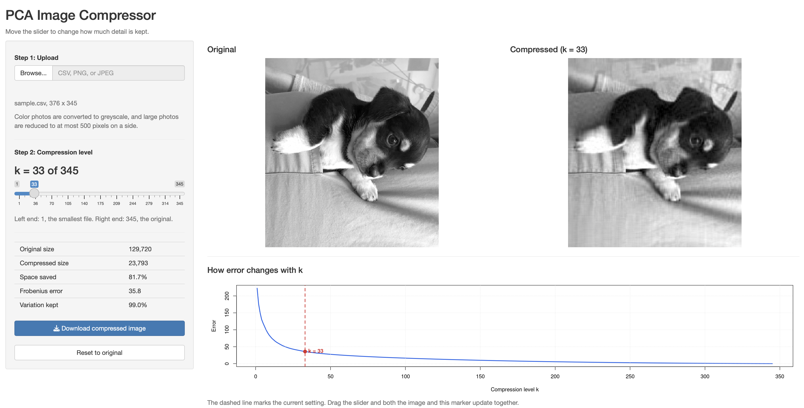

## What the app does

The app lets someone upload an image, choose how much compression to apply,
and see the compressed result next to the original. The compression is the
rank $k$ principal components approximation, and the single control that
matters is the value of $k$.

The upload takes any photo in PNG or JPEG form as well as the CSV format used
for the homework images. The method works on a single matrix of numbers, so a
color photo is converted to greyscale by averaging its red, green, and blue
values. Very large photos are reduced to at most 500 pixels on a side so that
the decomposition finishes in a second or two.

## The mockup

## Why it is laid out this way

**Controls on the left, results on the right.** Everything the user changes
sits in one column, and everything they look at sits in the other. That split
means the eye never has to hunt for a control, and the large area of the screen
goes to the thing the app exists to show. Putting the slider underneath the
images would have pushed the comparison off the top of the screen on a laptop.

**The two images are side by side and the same size.** The whole question the
user is asking is whether the compressed version still looks acceptable, and
that question is far easier to answer when the two are adjacent than when they
are stacked or shown one at a time behind a toggle. Both panels stay locked at
the same dimensions as $k$ changes so that nothing shifts underneath the
cursor while the slider is being dragged.

**The slider is the center of the interface.** It runs from 1 to $p$, and the
current value is printed above it in large type, since the number itself is
what the user will report or write down. The two ends are labeled with what
they mean rather than just their numbers, because "1" and "345" say nothing
about which direction is more compression. I chose a slider over a text box
because the useful behavior here is sweeping through values and watching the
image change, not typing a specific number.

**Numbers that answer the next question.** Under the slider sits a small panel
with the original size, the compressed size, the percentage saved, the
Frobenius error, and the proportion of variation retained. Someone who has just
decided the image looks fine will immediately want to know what they saved, and
that panel answers it without a second click.

**The error curve at the bottom, with the current $k$ marked.** The curve gives
context that a single error number cannot. A user who can see that the curve
has already flattened knows that pushing $k$ higher buys very little, and the
dashed marker ties the abstract curve to the image they are looking at. The
marker moves with the slider.

**Download and reset at the bottom of the sidebar.** Both buttons sit below
the statistics because they are the last things a user reaches for. The
download button saves the compressed image as a CSV with the same number of
rows and columns as the upload, so the file can be opened again or uploaded
back into the app. Reset to original moves $k$ to its maximum, which makes the
right-hand image match the original, and from there a user can sweep downward
to find the point where the picture starts to break. The download button is
the only filled button on the screen, which makes the primary action obvious
without labeling it as such.

## What I would want as a user

If I were using this myself, the thing I would care most about is being able to
drag the slider and watch the image change in real time, rather than setting a
value and pressing a button to recompute. Updating in real time requires the
eigendecomposition to happen once when the image is uploaded and be cached,
with the slider only recombining components that are already computed.
Recomputing the decomposition on every slider move would make the app feel
sluggish on any image of reasonable size.

I would also want the app to suggest a starting value rather than opening at
$k = 1$ or at full rank. The app opens at the smallest $k$ that retains 99% of
the total sum of squares, which puts most users close to a sensible answer
before they touch anything. I chose 99% over a rounder 95% because the columns
are not centered, so for an ordinary photo the first component carries the
overall brightness and 95% can be reached at $k = 1$ or $k = 2$, well before
the picture looks right.

I deliberately left two things out. There is no choice of color map or download
format, because neither affects the question the app is built around. And
there is no side panel explaining what principal components are: someone who
wants to compress an image should not have to read about eigenvectors first,
and the error curve communicates the trade-off without requiring the theory.
